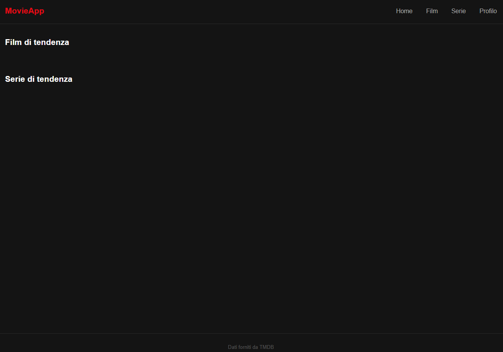
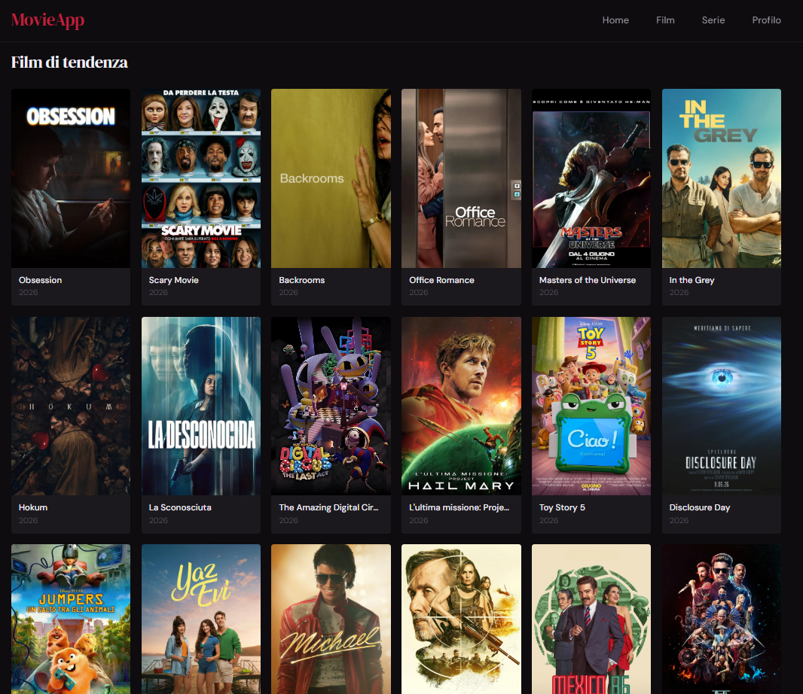
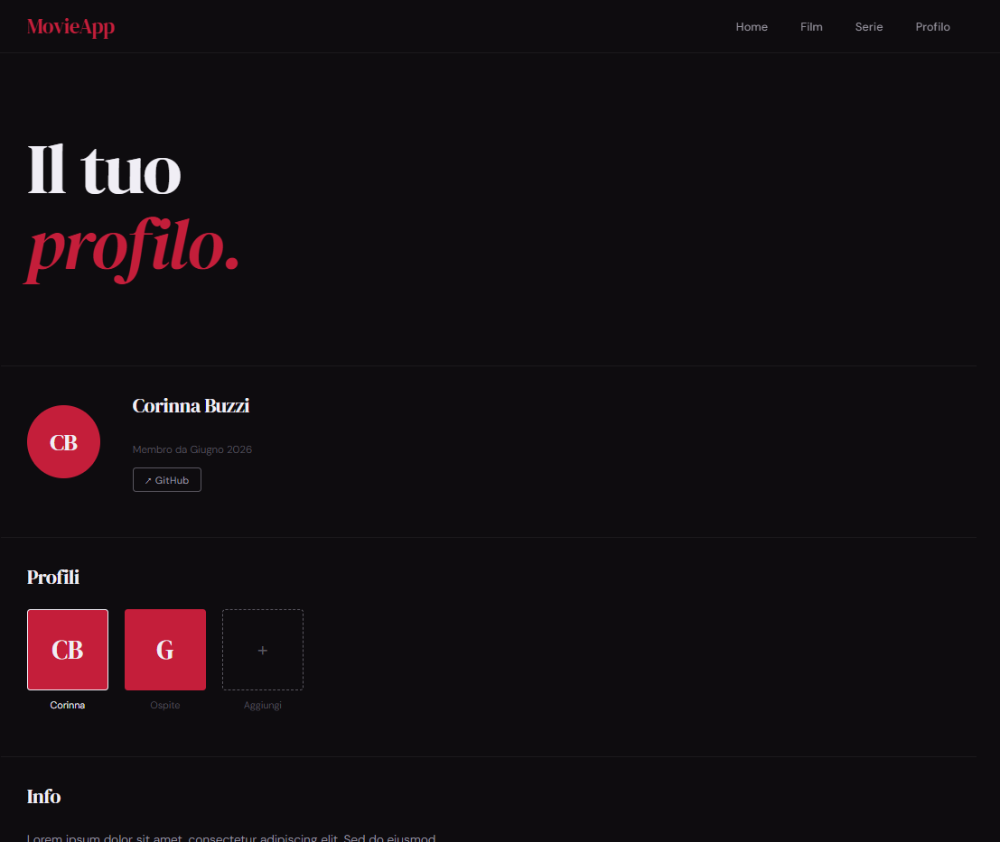
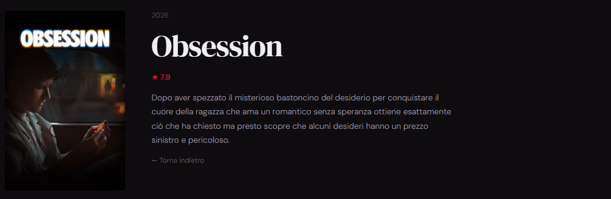
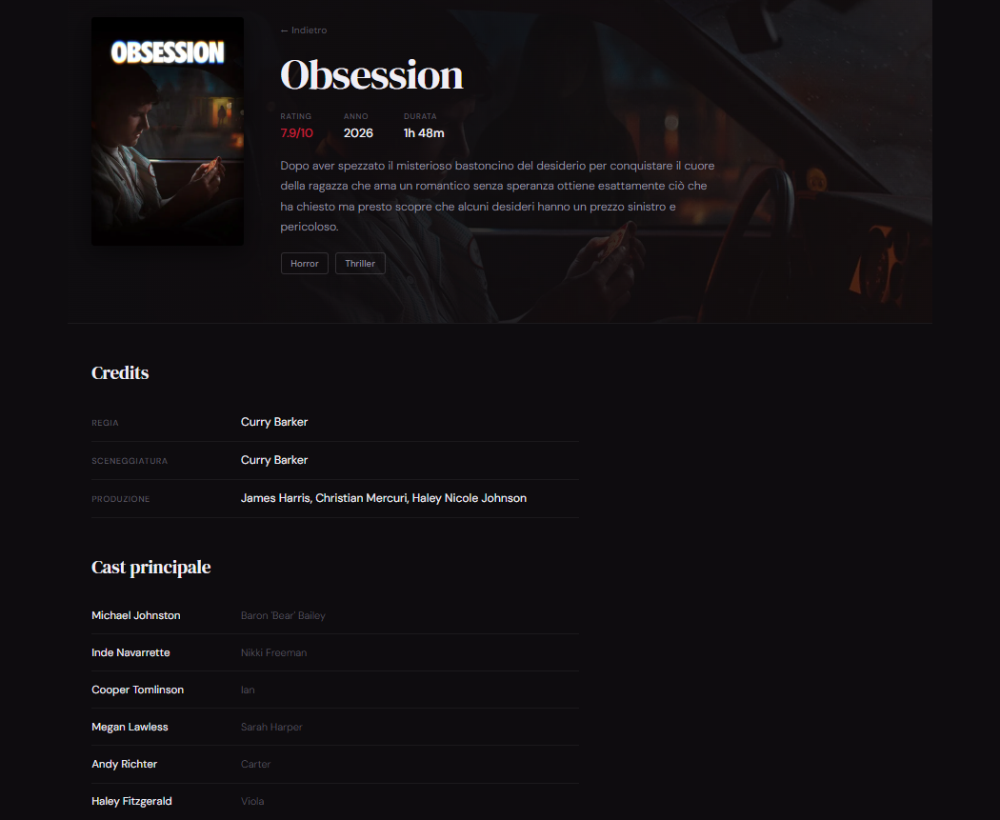

# Movie App

Progetto d'esame, modulo Frontend JS @ ITS Tech Talent Factory, 2026.

Autore: Buzzi Corinna

Traccia: https://github.com/lukeku62/esame-frontend

---

# Devlog 

## 0 — Init repo e struttura cartelle

Creata la repo e la struttura base del progetto:

```
movie-app/
├── index.html
├── movies.html
├── series.html
├── profile.html
├── css/
│   └── style.css
└── js/
    ├── config.js
    ├── api.js
    ├── main.js
    ├── movies.js
    └── series.js
```

## 1 — HTML e CSS

Creati `index.html` e `css/style.css` con i minimi requisiti strutturali:

- `<header>` con navbar e link alle pagine
- `<main>` con due sezioni: `#movies-grid` e `#series-grid`
- `<footer>`
- CSS: reset, dark background, griglia card con `auto-fill`, stile card minimale, media query per mobile



### Redesign e SSOT definition

Ridefinita l'estetica e stabilita la SSOT visiva tramite CSS custom properties:

**Palette**

- Background: `#0e0c0f`
- Accent: `#c41e3a`
- Testo primario: `#f0eef5`

**Font**

- Display (titoli, logo, h2): `DM Serif Display`
- Corpo (nav, testo, card): `DM Sans`

**Scelte stilistiche**

- Hero con titolo display grande, `<em>` in rosso corsivo, nessun gradiente
- Sezioni separate da `border-top` sottile
- Navbar con `backdrop-filter: blur(8px)`
- Card: `border-radius: 4px`, hover solo `translateY(-3px)`


---

## 2 — JS e fetch TMDB

### config.js

Creato `js/config.js` con la costante `API_KEY`. File escluso da Git.

### api.js

Creato `js/api.js` con:

- Costanti `BASE_URL` e `IMG_BASE_URL`
- `fetchTrendingMovies()` → `/trending/movie/day`
- `fetchTrendingSeries()` → `/trending/tv/day`
- `fetchPopularMovies()` → `/movie/popular`
- `fetchPopularSeries()` → `/tv/popular`

### main.js

Creato `js/main.js` con:

- `createCard(item, type)` — genera un `<div class="card">` con poster (o placeholder) + titolo + anno
- `renderCards(items, gridId, type)` — svuota il grid e appende le card
- `init()` — funzione `async` che chiama `fetchTrendingMovies` e `fetchTrendingSeries` con `try/catch` separati, mostra messaggio di errore inline in caso di fallimento
- `init()` chiamata direttamente a fine file

### movies.js e series.js

Creati `js/movies.js` e `js/series.js` con:

- `createCard(item, type)` — identica a quella in `main.js` (duplicazione consapevole, no moduli)
- `init()` — chiama rispettivamente `fetchPopularMovies` e `fetchPopularSeries` con `try/catch`
- `init()` chiamata direttamente a fine file



---

## 3 — profile.html

Creata `profile.html` con:

- Hero con nome autore
- Header profilo: avatar con iniziali, nome, data iscrizione, link GitHub
- Griglia profili: card con iniziali, stato attivo, card "Aggiungi" con bordo tratteggiato
- Sezione bio con testo placeholder
- Nessuna chiamata API — pagina interamente statica
- CSS aggiunto a `style.css`: `.profile-header-section`, `.profile-avatar-large`, `.profile-grid`, `.profile-card`, `.profile-badge`




---

## 4 — bonus! Dettaglio film/serie

Pagina dedicata a specifico film/serie con info (voto, descrizione, ecc) tramite chiamata API al database.

**Query string**: dati passati tramite URL, leggibili in JS senza bisogno di un server o di localStorage.

**Rendere le card cliccabili**

In `createCard()`, aggiunto un event listener sul `click` della card:

```js
card.addEventListener("click", () => {
  window.location.href = `detail.html?id=${item.id}&type=${type}`;
});
```

`window.location.href` equivale sostanzialmente a cliccare un link; è il modo vanilla per navigare programmaticamente

---

**`fetchDetail(id, type)` in `api.js`**

```js
async function fetchDetail(id, type) {
  const url = `${BASE_URL}/${type}/${id}?api_key=${API_KEY}&language=it-IT`;
  const response = await fetch(url);
  if (!response.ok) throw new Error(`Errore HTTP: ${response.status}`);
  return response.json();
}
```

Presenta una differenza rispetto alle altre funzioni fetch del progetto: invece di ritornare `data.results`, ritorna direttamente `response.json()`.

Nelle altre funzioni, dopo averlo parsato, andiamo a prendere `.results` perché TMDB ci restituisce un oggetto tipo:

```js
{ 
	"page": 1, 
	"results": [ {...}, {...}, {...} ], 
	"total_pages": 500 
}
```

Nell'endpoint di dettaglio, invece, TMDB restituisce direttamente l'oggetto del film:

```js
{
  "id": 693134,
  "title": "Dune: Parte Due",
  "overview": "...",
  "poster_path": "...",
  "vote_average": 7.8
}
```

Non c'è nessun array, nessuna proprietà `results` da estrarre, ma piuttosto ci dà direttamente l'oggetto che ci interessa come risposta intera. Quindi ritorniamo `response.json()` direttamente invece di `response.json().results`.

---

**`detail.js` — lettura dei parametri URL**

```js
function getParams() {
  const params = new URLSearchParams(window.location.search);
  return {
    id: params.get("id"),
    type: params.get("type"),
  };
}
```

`window.location.search` restituisce la query string dell'URL corrente (es. `?id=693134&type=movie`).

`URLSearchParams` è una API nativa del browser che parsa la query string e permette di leggere i singoli parametri con `.get()`. L'alternativa sarebbe farlo a mano: separare la query string con `.split("&")`, poi separare ogni coppia chiave-valore con `.split("=")`. 
`URLSearchParams` gestisce tutto internamente, inclusi casi edge come parametri con valori vuoti o caratteri speciali encodati.

---

**`renderDetail(item, type)` — costruzione del DOM**

La funzione riceve l'oggetto TMDB e costruisce il layout con `innerHTML`. Gestisce tre casi edge:

- `item.overview` può essere stringa vuota — fallback a `"Nessuna descrizione disponibile."`
- `item.vote_average` può essere `0` o assente — `.toFixed(1)` formatta il numero a una cifra decimale, fallback `"—"`
- `item.poster_path` può essere `null` — stesso pattern placeholder usato nelle card

---

**`init()` — orchestrazione**

```js
async function init() {
  const { id, type } = getParams();
  const container = document.querySelector("#detail-container");

  if (!id || !type) {
    container.innerHTML = `<p class="error-msg">Parametri mancanti.</p>`;
    return;
  }

  try {
    const item = await fetchDetail(id, type);
    renderDetail(item, type);
  } catch (err) {
    container.innerHTML = `<p class="error-msg">Errore nel caricamento del dettaglio.</p>`;
    console.error(err);
  }
}
```

Il controllo `if (!id || !type)` gestisce il caso in cui qualcuno apra `detail.html` direttamente senza parametri. Il `return` anticipato evita di fare una fetch con parametri `null` che produrrebbe un URL malformato e un errore poco leggibile.

---

**`detail.html` — stato di caricamento**

Il container parte con un messaggio "Caricamento..." visibile mentre la fetch è in corso:

```html
<section class="content-section" id="detail-container">
  <p class="loading-msg">Caricamento...</p>
</section>
```

Quando `renderDetail` esegue, sovrascrive l'intero `innerHTML` del container con il contenuto reale. È il pattern più semplice per gestire uno stato di caricamento senza librerie.



---

## 5 — Redesign detail page

Redesign completo della pagina di dettaglio: da layout semplice (poster + testo) a pagina strutturata con hero, meta, credits e cast.

**Obiettivo**: arricchire le informazioni mostrate sfruttando gli endpoint TMDB disponibili, mantenendo coerenza visiva col resto del sito.

---

**Nuova chiamata API: `fetchCredits(id, type)`**

Aggiunta in `api.js` una funzione per l'endpoint `/credits`:

```js
async function fetchCredits(id, type) {
  const url = `${BASE_URL}/${type}/${id}/credits?api_key=${API_KEY}&language=it-IT`;
  const response = await fetch(url);
  if (!response.ok) throw new Error(`Errore HTTP: ${response.status}`);
  return response.json();
}
```

L'endpoint restituisce due array: `cast` (attori, ordinati per importanza) e `crew` (tecnici: regista, sceneggiatori, produttori, ecc). A differenza di `fetchDetail`, qui non c'è un singolo oggetto da restituire — si restituisce direttamente il JSON e si filtrerà nel render.

---

**`Promise.all` — fetch parallele**

In `init()`, le due fetch vengono lanciate in parallelo invece di in sequenza:

```js
const [item, credits] = await Promise.all([
  fetchDetail(id, type),
  fetchCredits(id, type),
]);
```

`Promise.all` riceve un array di Promise e restituisce una nuova Promise che si risolve quando tutte si completano — con un array dei loro risultati nello stesso ordine. Il vantaggio rispetto a due `await` separati è il tempo: se ogni fetch impiega 300ms, in sequenza si aspettano 600ms, in parallelo ~300ms.

---

**Hero con backdrop**

Il nuovo hero usa `backdrop_path` (o `poster_path` come fallback) come immagine di sfondo, passata come CSS custom property:

```js
const backdropUrl = backdropPath
  ? `https://image.tmdb.org/t/p/w1280${backdropPath}`
  : null;
```

```html
<div class="detail-hero" style="--backdrop-url: url('${backdropUrl}')">
```

```css
.detail-hero {
  background-image: var(--backdrop-url, none);
}
```

Un gradiente overlay (`linear-gradient` da sinistra) garantisce la leggibilità del testo sopra l'immagine indipendentemente dal contenuto del backdrop.

---

**Meta grid — dati condizionali**

Rating, anno e durata vengono mostrati solo se il dato esiste realmente:

```js
if (runtime) {
  metaItems.push(`...`);
}
```

La durata (`runtime`) è presente solo per i film — le serie TV non hanno questo campo nell'endpoint standard. Questo evita di mostrare "—" o valori vuoti che degradano l'esperienza.

---

**Estrazione dati dalla crew**

La `crew` di TMDB è un array flat con tutti i ruoli. Per estrarre registi e sceneggiatori si filtra per `job`:

```js
const directors = crew.filter(p => p.job === "Director").map(p => p.name);
const writers = crew.filter(p => ["Screenplay", "Writer", "Story"].includes(p.job)).map(p => p.name);
```

Per le serie TV, TMDB espone i creatori in un campo separato (`item.created_by`), che viene gestito come caso distinto:

```js
const creators = item.created_by?.map(p => p.name) || [];
```

L'operatore `?.` (optional chaining) evita un errore se `created_by` è `undefined` — restituisce `undefined` invece di lanciare un'eccezione, che l'`|| []` converte in array vuoto.

